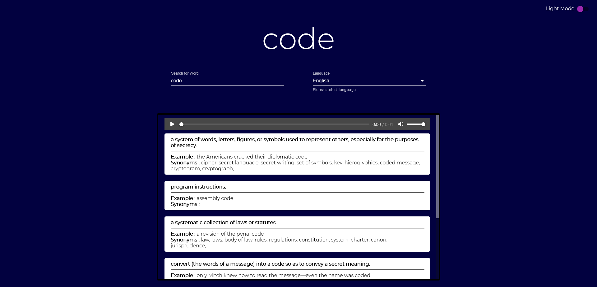
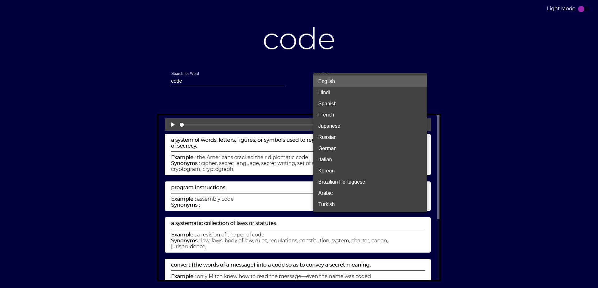

## Dictionary app with ReactJS and Material UI

:sparkles: **Features**

* Search for words
* Select your language
* Meanings and Synonyms
* Audio phonetics
* Dark mode

> API used: [Free Dictonary API](https://dictionaryapi.dev/)

### Live [here](https://dictionaryreactjs.netlify.app/)

> Preview 1

> Preview 2

